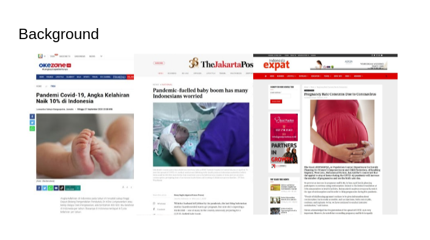
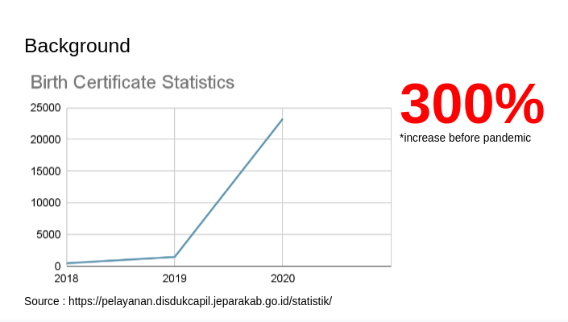
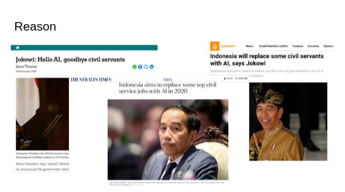
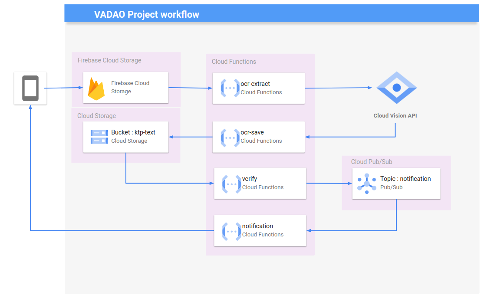

### VADAO

Hey there 👋,

This is the cloud repository of VADAO Projects.
What is VADAO? VADAO stands for Validation Data using Optical Character Recognition (OCR). This project using OCR to extract text from the image (in this case is resident document) and validate/verify/match it or something like that.

  ---

### Background

Why we created VADAO?
Covid-19 had big impact of all our lives in many aspects. In Indonesia, birth rates raised up to 10% and in Jepara, request of the birth certificate is increasing up to 3 times before pandemic.

Therefore, the validation officers in DISDUKCAPIL Jepara felt overwhelmed with their task. They had already 7 officers but could only managed more or less 100 documents even though there are up to 400 documents in every day.

In line with Indonesian President, Mr Joko Widodo said that Indonesia will replace civil servants/officers with ai. VADAO is the first step to implement this.

 ---

### Cloud on VADAO

Here is the architecture of the cloud on VADAO.
We are using **Firebase Storage** to save the uploaded images. A **Cloud Functions** will trigger **Cloud Vision AI** to extract the text in the images and send the text to **Pub/Sub**. Pub/Sub will delivere the message from Vision AI to save it in **Cloud Storage**. Whenever that storage saved new objects, it will trigger another function to validate the content. After the validation compleate, it will send email notification through third party, in this case **sendgrid**, to send email to the recipient.

